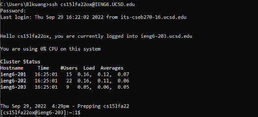
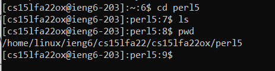
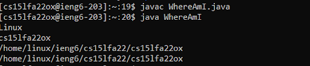
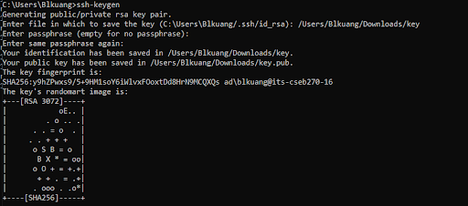
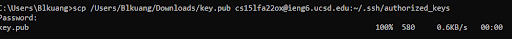
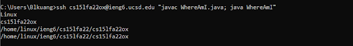

# Getting Started
> "It's harder to read code than to write it" - Joel Spolsky

### Installing Visual Studio Code
Visual Studio Code (VS Code) is an IDE that allows you to edit code (along with a wide array of things, including  writing guides in markdown, like this one).

1. Go to the [VS Code](https://code.visualstudio.com/Download) website to download it
2. Click on the correct download for your operating system (OS)
3. Click on the downloaded .exe file
4. You should see the following window:

5. Blindly accept/click next on all of the following steps. VS Code should be installed promptly.

### Getting Your CSE 15L Account

You need your CSE 15L Account in order to do this lab. 

You can find that [here](https://sdacs.ucsd.edu/~icc/index.php
)

**It is highly advised NOT to change your password through this lab. More than one student, including me, has gotten issues when doing that.**

# The Actual Lab Portion

* Make sure to ask when you have questions or things constantly break

### Remotely Connecting

* Your computer, the "Client," is connecting to another, the "Server"

To remote connect, we will need to open up a terminal.
You can open up a terminal in one of two options: 
1. In VS Code, use CTRL or Command + '. 

You can also use Terminal ► New Terminal

2. Windows: Windows Key + R, type in "cmd" and enter. \
Mac: Command + Space, Type in "Terminal" into the bar.

In the Terminal, type out the command below. 

**Replace the ```[YOUR-USER-NAME]``` with your CSE 15L user name.**
```
ssh [YOUR-USER-NAME]@ieng6@ucsd.edu
```

You will likely get prompted with a message like this if this the first time you connect:
```
The authenticity of host 'ieng6.ucsd.edu (128.54.70.227)' can't be established.
RSA key fingerprint is [IGNORE THIS]
Are you sure you want to continue connecting (yes/no/[fingerprint])? 
```
Type in ```yes``` and enter to connect. 

>According to Professor Joe Politz, if a prompt like this appears when you're connecting to a server you connect to **often**, "it could mean someone is trying to listen in on or control the connection."

You should see a prompt for a password now. Type your password in. 
**You won't be able to see your password as your typing it. There have been students confused by this and thinking that their keyboards broke.**

You should now see something like this:


Once you see the file path on the left change, you'll know that you are connected remotely. 

You are now running in the server.

### Run Some Commands

Now that you're in the server, run some commands that you've (hopefully) learned in class. 


Commands to Try:
* ``cd``
* ``ls``
* ``cp``
* ``cat``

### Moving Files over SSH with scp

To move over files, we need to make a file.
For this example, make a file named "WhereAmI.java" and copy the following JAVA code into it
```java
class WhereAmI {
  public static void main(String[] args) {
    System.out.println(System.getProperty("os.name"));
    System.out.println(System.getProperty("user.name"));
    System.out.println(System.getProperty("user.home"));
    System.out.println(System.getProperty("user.dir"));
  }
}
```
Then, in your terminal, compile and run the program using the commands below:
```
javac WhereAmI.java
java WhereAmI
```

You should see file paths be printed. If you don't consult a local TA.

Then, type in this command in the directory you made the java file in:
```
scp WhereAmI.java [YOUR-USER-NAME]@ieng6.ucsd.edu:~/
```

Then, use SSH to log into ieng6. You should be able to use 
```
javac WhereAmI.java
java WhereAmI
```
in the server terminal now. (See below)


### SSH Keys

Isn't it annoying to keep typing your lengthy (and perhaps complex) password everytime you want to use ssh to access the server?
Well now you can *stop* doing that! (After you do this somewhat lengthy and perhaps complex step).

ssh keys uses a system where you, the client, have a private key, and the server has a public key. 

>This system of "authentication" acts similarly to using a password, but uses the files on your and the server's computer instead.

On the client:
```
ssh-keygen
Generating public/private rsa key pair.
Enter file in which to save the key (/Users/[YOU]/.ssh/id_rsa): /Users/[YOU]/.ssh/key
Enter passphrase (empty for no passphrase): 
Enter same passphrase again: 
Your identification has been saved in /Users/[YOU]/.ssh/key.
Your public key has been saved in /Users/[YOU]/.ssh/key.pub.
The key fingerprint is:
------Ignore------
The key's randomart image is:
+---[RSA 3072]----+
You will see random characters here
+----[SHA256]-----+
```
Remember to put your computer user in the ``[YOU]`` portion. For the passphrase, just press enter.

Here's how it should roughly look:



You will then see that 

Then, run an scp on the **client** side to copy over your key file to the server



Great! You can now connect to the server without using your password. 

### Optimizing Remote Running

Now, you're going to try to create a process where you can make a local edit to ``WhereAmI.java`` and comfortably run it.

You can put the commands you want to run in quotes ``" "`` after an scp

>For example, ``ls, javac, java, cat`` etc.




