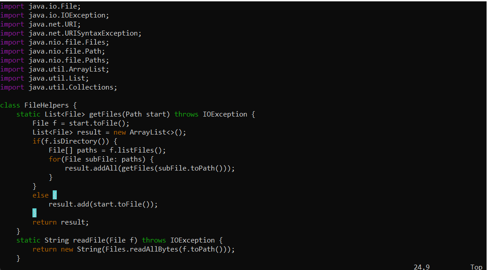

# lab 4
## Part 1
Task: "In DocSearchServer.java, change the name of the start parameter of getFiles, and all of its uses, to instead be called base."

This is the file I have when opening up DocSearchServer.java using `` vim DocSearchServer.java``



The Shortest Sequence I found was 
```
/start <enter> x x x x x i b a s e <esc> /start <enter> x x x x x i b a s e <esc> /start <enter> x x x x x i b a s e <esc> :wq
```

1. First, I use ``/start`` to navigate to the first start


2. Then, I press ``x`` five times to delete the word: 


3. Then, I press ``i`` to go into insert mode and follow with ``b a s e`` to type in base; then you ``<esc>`` to return to normal mode.


4. I use ``/start`` again to navigate to the 2nd start


5. Then, I press ``x`` five more times to delete the word: 


6. Then, I press ``i`` to go into insert mode and follow with ``b a s e`` to type in base; then you ``<esc>`` to return to normal mode.


7. I use ``/start`` again to navigate to the last start


8. Then, I press ``x`` five more times to delete the word: 


9. Then, I press ``i`` to go into insert mode and follow with ``b a s e`` to type in base. Then you ``<esc>`` to return to normal mode.


Lastly, you do ``:eq`` to exit and save the file.

## Part 2

>Once, start in Visual Studio Code and make the edit there, then scp the file to the remote server and run it there to confirm it works (you can just run bash test.sh on the remote to test it out). Consider having the appropriate scp command in your command history or easily copy-pasteable!
>Second, start already logged into a ssh session. Then, make the edit for the task you chose in Vim, then exit Vim and run bash test.sh.

This took me ~220 seconds to do; the actual editing was pretty fast but I kept mistyping my password to get into the ssh. 

>Consider performing the edit task you chose and re-running the program when you have to run it remotely

On the vim side, it took me 50 seconds, *not including the time it took to ssh into theremote server*. While this can be shortened immensely through muscle memory, I'm not sure if that's a reasonable application of vim. 

>Which of these two styles would you prefer using if you had to work on a program that you were running remotely, and why?

I would *prefer* editing on local even if vim has the potential to be faster because I am afraid of fat-fingering (mistyping) on vim and not understanding what i did wrong. 

>What about the project or task might factor into your decision one way or another? (If nothing would affect your decision, say so and why!)

If this is a speedrunning task that's already laid out for me to prepare for, vim would be faster because there's less keypresses and window changes and I can use muscle memory to power through it.


