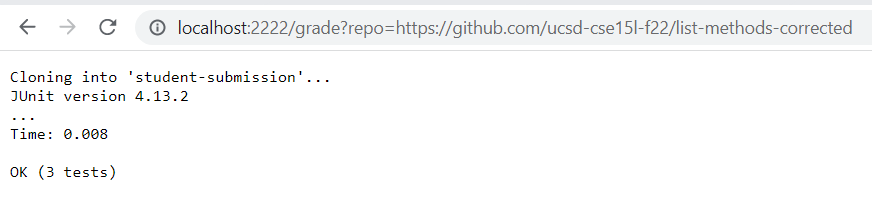
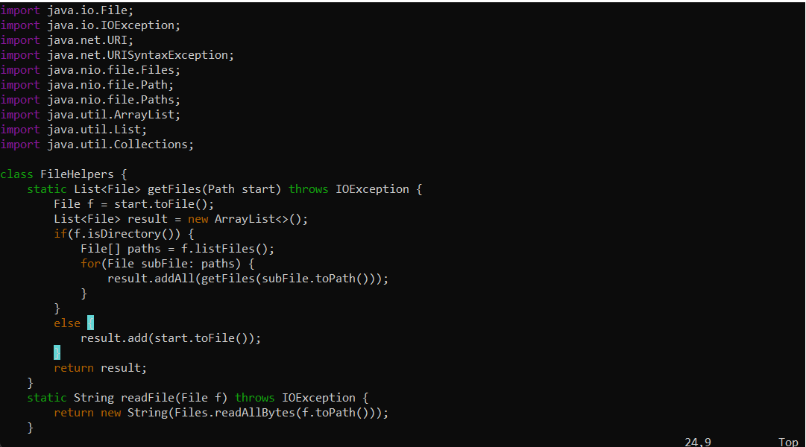

# Lab 5

Here is my grade.sh script:
```
set -e
rm -rf student-submission
git clone $1 student-submission
cp -R ./lib ./student-submission
cp *.java ./student-submission
cd student-submission
javac -cp  ".;lib/hamcrest-core-1.3.jar;lib/junit-4.13.2.jar" *.java
java -cp ".;lib/hamcrest-core-1.3.jar;lib/junit-4.13.2.jar" org.junit.runner.JUnitCore TestListExamples
```
Below are the three screenshots for the GradeServer implementation with different repository URL parameters: 






## Script Tracing

Using example: https://github.com/ucsd-cse15l-f22/list-methods-corrected

1. ``set -e``
> set -e just makes the script stop running when we run into an error

Standard Output: nothing

Exit Code: 0

2. ``rm -rf student-submission``
> This removes any student-submission directory that may have previously been cloned

Standard Output: nothing

Exit Code: 0


3. ``git clone $1 student-submission``
>This clones the repository $1—the parameter that was passed through the calling of the script (from GradeServer.java) —into student-submission.

Standard Output: nothing

Exit Code: 0


4. ``cp -R ./lib ./student-submission``
> This copies over the libraries for hamcrest and junit over into the newly created student-submission directory.

Standard Output: nothing

Exit Code: 0

5. ``cp *.java ./student-submission``
> This copies over all java files over into the newly created student-submission directory.

Standard Output: nothing

Exit Code: 0

6. ``cd student-submission``
> We change the working directory to the newly created student-submission directory.

Standard Output: nothing

Exit Code: 0

7. ``javac -cp  ".;lib/hamcrest-core-1.3.jar;lib/junit-4.13.2.jar" *.java``
> Here, we compile all java files (from the student and also the ones we cp'd over into this directory). 

Standard Output: nothing

Exit Code: 0

8. ``java -cp ".;lib/hamcrest-core-1.3.jar;lib/junit-4.13.2.jar" org.junit.runner.JUnitCore TestListExamples``
> This runs the TestListExamples.java file (one that we cp'd over into this directory) that tests the student's list-example implementation. 

Standard Output: 
```Cloning into 'student-submission'...
JUnit version 4.13.2
...
Time: 0.008

OK (3 tests)
```
Exit Code: 0